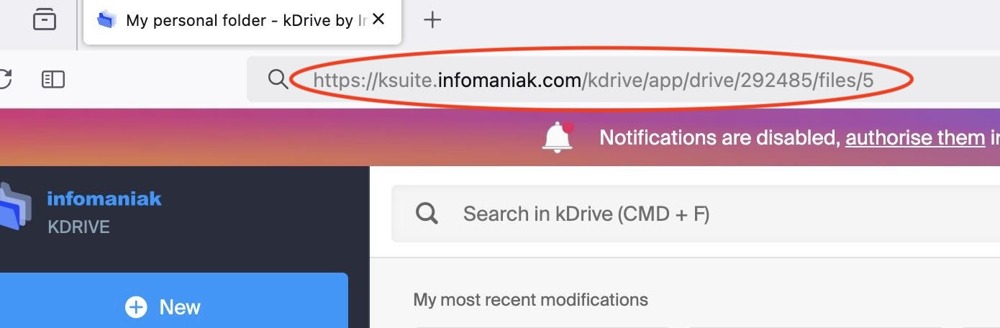

# Infomaniak KDrive Plugin for Dataiku DSS

## Overview

This Dataiku DSS plugin enables seamless integration with Infomaniak's KDrive, allowing users to connect, manage, and analyze data stored in KDrive directly within the Dataiku DSS environment. This plugin leverages the KDrive API to facilitate data operations, making it easier to incorporate KDrive data into your data science and analytics workflows.

## Installation

### On Infomaniak's side
- Go to the [Infomaniak's management interface](https://manager.infomaniak.com/v3/ng/profile/user/token/list)
- Click on *Create a token*
- Select *drive - Drive products* in the *scopes* selector
- Choose a period of validity.
- Click the blue button *Create a token*
- Copy the token

### On Dataiku's side, as an administrator
- Create a preset for the plugin Applications > Plugins > Installed > Infomaniak > Settings > API Token

### For each Dataiku user
- Go to the user's profile > Credentials > find the preset created by the administrator and click on *Fill In*
- Paste the token copied from the Infomaniak's management interface

## Usage

### Create a dataset out of files stored on KDrive

1. On a Dataiku flow, click on +Dataset > Infomaniak > KDrive

2. Select the preset
3. Copy the URL of your KDrive and paste it in the dataset's interface

### Create a read / write managed folder linked to a KDrive folder

1. On a Dataiku flow, click on +Dataset > Folder
2. Int the *Settings* tab, select the preset and paste your KDrive's URL
3. Click on *Browse* and browse to the KDrive folder to be used as root of your managed folder. 

## License

This plugin is distributed under the Apache License version 2.0
